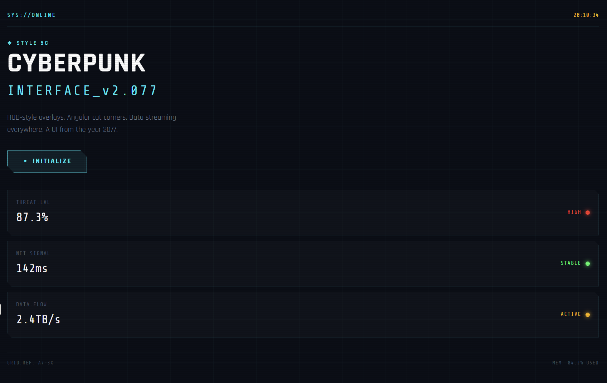
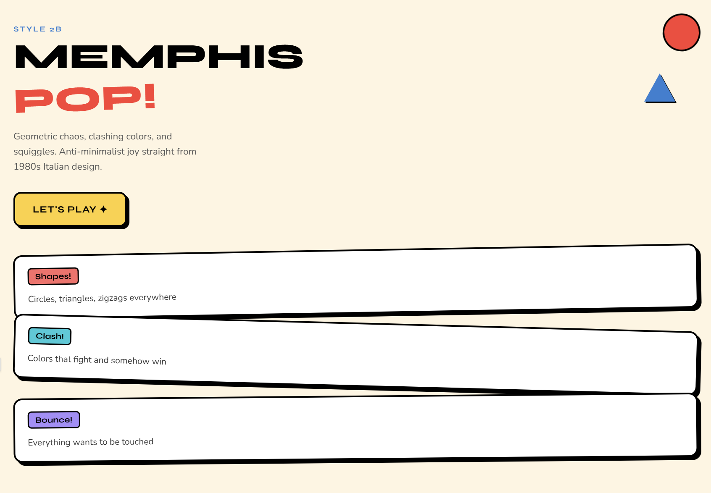
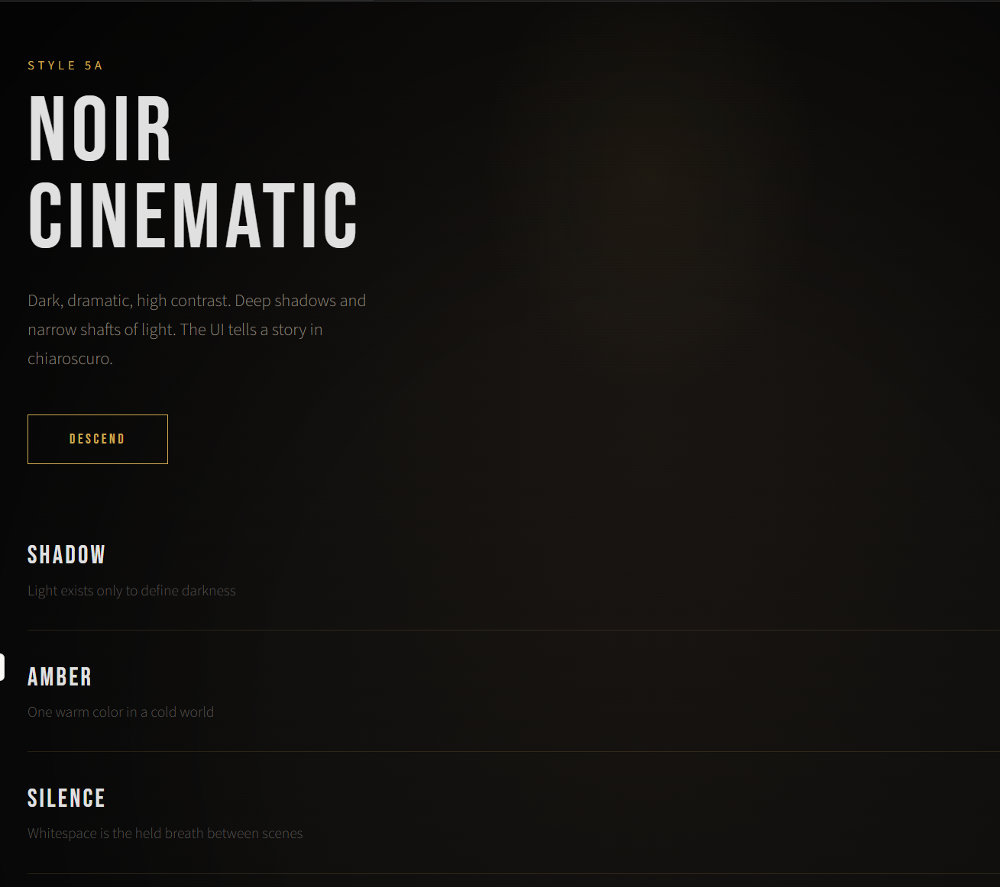
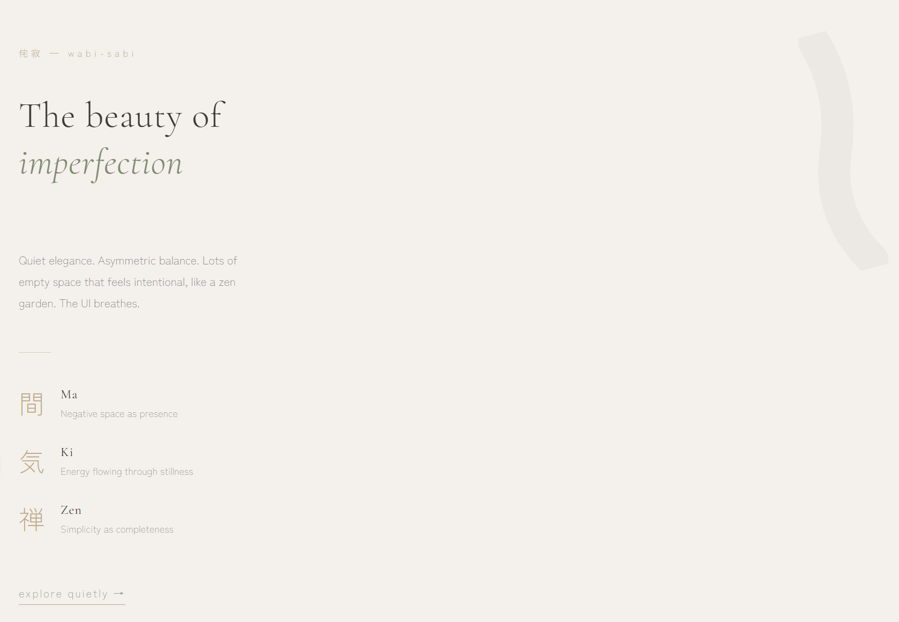
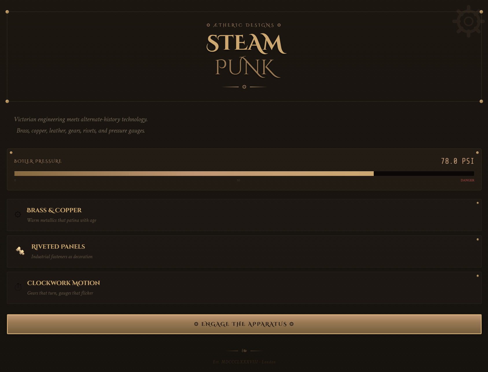
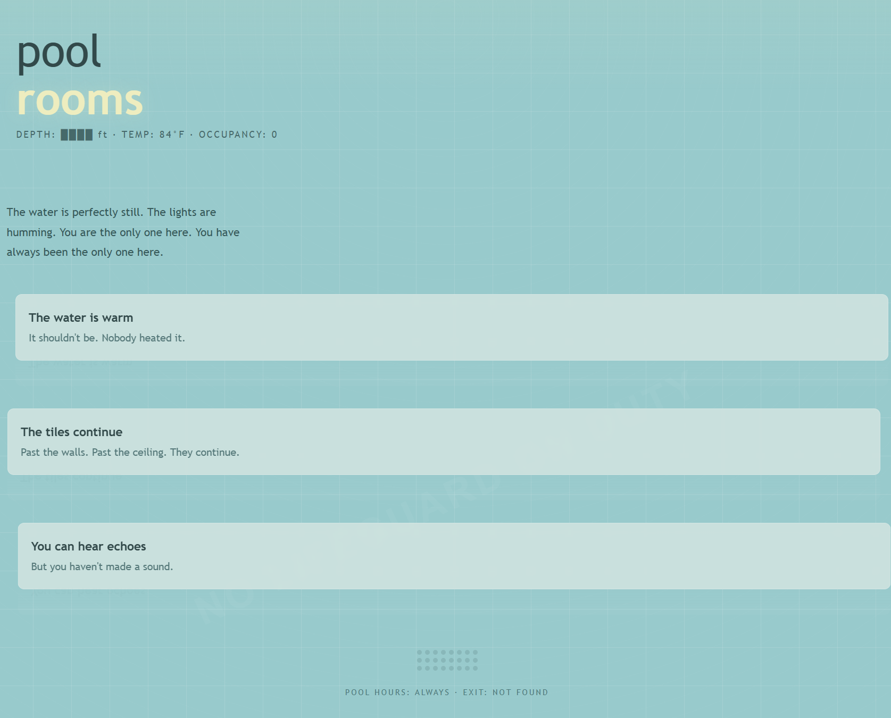

# 🎨 UI Style Catalog

**Copy-paste design briefs for people who build with AI.**

*Design & curation by [Steven Plummer](https://github.com/stevenplum9-sketch)*

---

You know that moment when you're vibecoding at midnight and you tell Claude or Cursor "make it look good" and you get back the same Inter font, purple gradient, white card layout that every AI spits out?

This is the fix.

This repo is a menu. 107 UI styles across 24 categories, each one a self-contained block you can drop into your AI coding tool and get something that actually looks *designed* — not generated. Every style has specific fonts, hex codes, spacing rules, motion specs, and a "distinctive element" that makes it impossible to confuse with anything else.

Some of them are practical. Some of them are unhinged. All of them are better than another purple gradient.

## Preview

<p align="center">
  
  
  
</p>
<p align="center">
  
  
  
</p>
<p align="center">
  <em>Cyberpunk Interface · Memphis Pop · Noir Cinematic · Japanese Minimalism · Steampunk · Weirdcore Poolrooms</em>
</p>

These are 6 out of 107 styles. Full catalog: **[CATALOG.md](CATALOG.md)**

## How it works

1. Open the **[Style Catalog](CATALOG.md)**
2. Find one that fits your project (or your mood)
3. Copy the block
4. Paste it into your AI tool

That's it. No npm install. No dependencies. No build step. Just words that make AI produce better frontends.

## Ways to use it

**Drop it in CLAUDE.md:**
```
## Design Style
[paste style block here]
```

**Inline prompt in any AI coding tool:**
```
Use this style for the app: [paste style block]
```

**Mix and match pieces:**
```
Use the typography from Magazine Editorial (4B),
the color palette from Ocean Depths (13C),
and the spacing philosophy from Analytics Clean (10C).
```

**Generate a tailwind config from it:**
```
Use this style: [paste block]
Generate a tailwind.config.js that implements these design tokens,
then build the UI using those tokens.
```

## What's in here

| Section | Styles |
|---|---|
| **Minimal & Clean** | Swiss Precision, Japanese Minimalism, Scandinavian Functional, Monochrome Stripped |
| **Bold & Expressive** | Neon Maximalist, Memphis Pop, Brutalist Web, Gradient Overload |
| **Retro & Nostalgic** | Terminal Green, Vaporwave, Y2K Millennium, 8-Bit Pixel, 90s OS |
| **Editorial & Typographic** | Newspaper Broadsheet, Magazine Editorial, Monospace Literary |
| **Dark & Moody** | Noir Cinematic, Midnight Luxury, Cyberpunk Interface |
| **Soft & Organic** | Pastel Cloud, Earth & Clay, Watercolor Wash |
| **Industrial & Utilitarian** | Construction Blueprint, Military Tactical, Warehouse Label |
| **Luxury & Refined** | Art Deco Glamour, Swiss Luxury Brand, Fashion Runway |
| **Playful & Whimsical** | Storybook Illustration, Candy Pop, Paper Cutout |
| **Data-Dense & Dashboard** | Mission Control, Developer IDE, Analytics Clean |
| **Glassmorphism & Depth** | Frosted Glass, Neumorphism |
| **Geometric & Structured** | Isometric Grid, Bauhaus, Grid Reveal |
| **Nature & Earth** | Pacific Northwest, Desert Minimal, Ocean Depths |
| **Culture & Era-Specific** | Tokyo Street, Scandi Noir, Afrofuturism |
| **Genre & Mood** | Horror Dark Fantasy, Solarpunk, Cozy Cabin |
| **Industry-Specific** | Fintech Premium, Health & Wellness, Dev Tool, E-Commerce, SaaS Landing |
| **Custom & Genre Mashups** | Cypherpunk, Rockabilly, Steampunk, Space Western, Enlightenment Era, Techno-Anarchist, Punk-a-Billy, Techno-Anarchocapitalist |
| **Historical & Revival** | Constructivist Propaganda, Zoot Suit / Pachuco, Vienna Secession, Metabolist Architecture, Frutiger Aero |
| **Niche & Underground** | Cottagecore Tech, Dark Academia, Goblincore, Weirdcore (5 variants), Cassette Futurism, Diesel Deco, Salvagepunk, Hauntology, Dieselwave |
| **Fast Food & Convenience** | 80s/90s Pizza Hut, 80s/90s Taco Bell, 90s McDonald's PlayPlace, Waffle House, Sonic Drive-In, In-N-Out, 7-Eleven, QuikTrip, Buc-ee's |
| **Movie & Film Inspired** | Tron, The Matrix, Alien / Nostromo, Lord of the Rings, Wes Anderson, Stranger Things / 80s Spielberg, Kill Bill |
| **Music Genres** | Jazz Club, Death Metal, Lo-fi Hip Hop, Reggae / Dub |
| **Decades** | 1920s Prohibition / Speakeasy, 1960s Mod, 1970s Disco |
| **Places** | Tokyo Convenience Store, Havana 1955, NYC Subway 1980s |

Full catalog with every style block: **[CATALOG.md](CATALOG.md)**

## What each style block looks like

Every entry follows the same structure so AI tools can parse it consistently:

```
STYLE: [Name]
VIBE: [What it feels like, what it's inspired by, when to use it]

TYPOGRAPHY: [Specific font names, weights, sizes, pairing rules]
COLORS: [Hex codes for every role — background, text, accent, borders]
SPACING: [Base unit, padding philosophy, layout approach]
BORDERS & SHAPES: [Border-radius, shadows, decorative elements]
MOTION: [Animation timing, hover states, scroll behavior]

DISTINCTIVE ELEMENT: [The one thing that makes this style unmistakable]
```

The specificity is the point. Vague descriptions produce vague output. Hex codes, font names, and pixel values produce consistent results.

## Some personal favorites

**For when you want to ship something that looks like a real product:**
Analytics Clean (10C), Dev Tool (16C), SaaS Landing (16E)

**For when you want people to remember your site:**
Noir Cinematic (5A), Cyberpunk Interface (5C), Tokyo Street (14A)

**For when you want to feel something:**
Japanese Minimalism (1B), Hauntology (19H), Solarpunk (15B)

**For when you want to make something weird:**
Weirdcore Maximum Uncanny (19D-v), Salvagepunk (19G), Brutalist Web (2C)

**For when you want to have fun:**
Memphis Pop (2B), 8-Bit Pixel (3D), Punk-a-Billy (17G)

**For when it's 2am and you're feeling cinematic:**
Tron (21A), The Matrix (21B), Kill Bill (21G)

**For when you're hungry:**
Waffle House (20D), Buc-ee's (20I), 80s/90s Taco Bell (20B)

## Why this exists

I started vibecoding in January 2026. Built a bunch of apps. They all worked. They all looked like AI made them.

The problem wasn't the tools. The problem was that "make it look good" isn't an instruction. It's a wish. And AI is really good at following instructions and really bad at granting wishes.

So I started writing specific design briefs — this font, this color, this spacing, this ONE distinctive element that makes the whole thing cohere. The output got dramatically better. Then I kept writing more, and more, and eventually I had a catalog.

Now you have it too.

## Contributing

Got a style that should be in here? Open a PR. The format is in every existing entry. Follow the structure, be specific (hex codes not color names, font names not "a nice serif"), and include a distinctive element.

Styles that work well tend to have a strong *opinion*. "Clean and modern" isn't a style. "Brutalist web where every button looks like it was coded in Notepad in 1996" is a style.

## License

MIT. Use it however you want. Credit is cool but not required.
